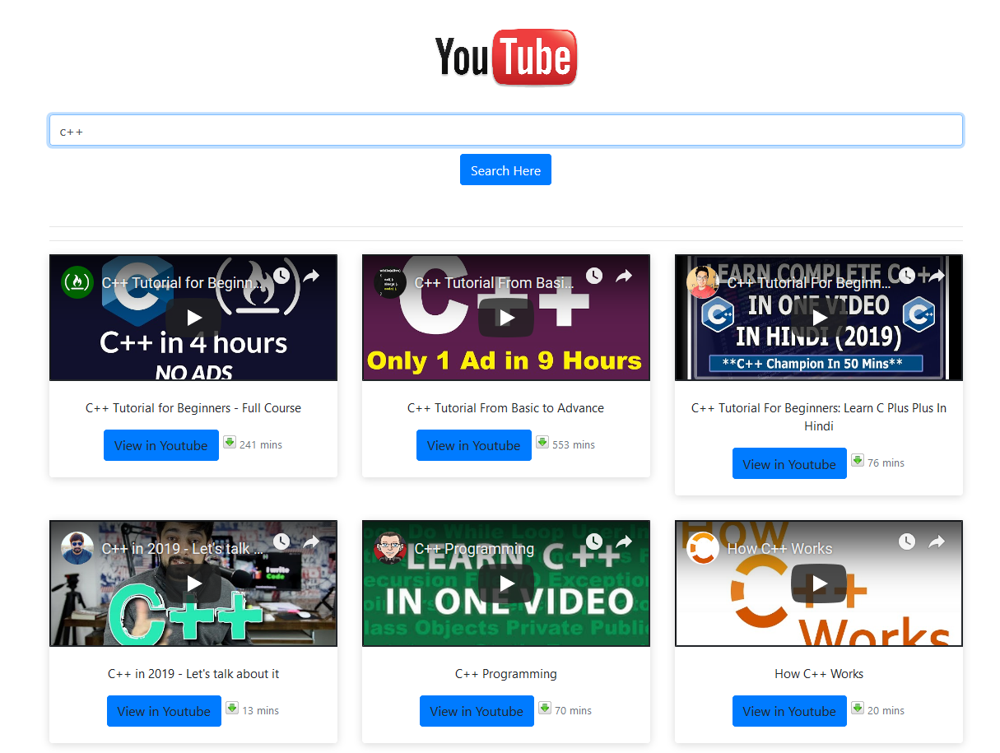

# Django Youtube Search Demo


## About

It was made using **Python 3.7** + **Django** and database is **SQLite**.
**Bootstrap** was used for styling.

Anyone can search and play video and also able to view that video in youtube.

## Prerequisites

Install virtual environment:

```bash
$ virtualenv .
```

 Activate virtual environment:
On Windows:
```bash
$ .\Scripts\activate
```

Install dependencies:
```bash
$ pip install -r requirements.txt
```

## How to run

### Default

You can run the application from the command line with manage.py.
Go to the root folder of the application.

Run migrations:
```bash
$ python manage.py migrate
```

Initialize data:
```bash
$ python manage.py loaddata users posts comments
```

Run server on port 8000:
```bash
$ python manage.py runserver 8000
```

